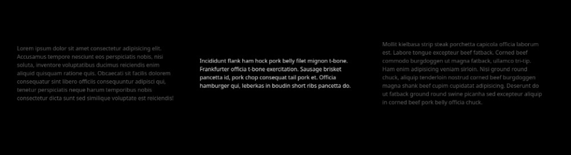

# Embla Carousel Snap Class



Inspired by [embla-carousel-class-names](https://github.com/davidjerleke/embla-carousel/tree/master/packages/embla-carousel-class-names)

A plugin for Embla Carousel that adds a class only to the snapped slide.

## Setup

```
npm install embla-carousel-snap-class
```

```
import SnapClass from "embla-carousel-snap-class"

const emblaContainer = document.querySelector(".embla") as HTMLElement;
Embla(emblaContainer, {}, [SnapClass()]);
```

## Options

The Plugin accepts the following options:

```
{
    <!-- Changes the name of the class added to the snapped slide -->
    className: string
}
```
